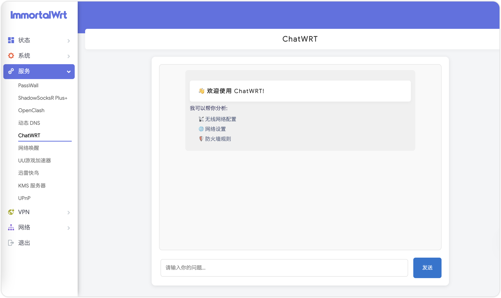
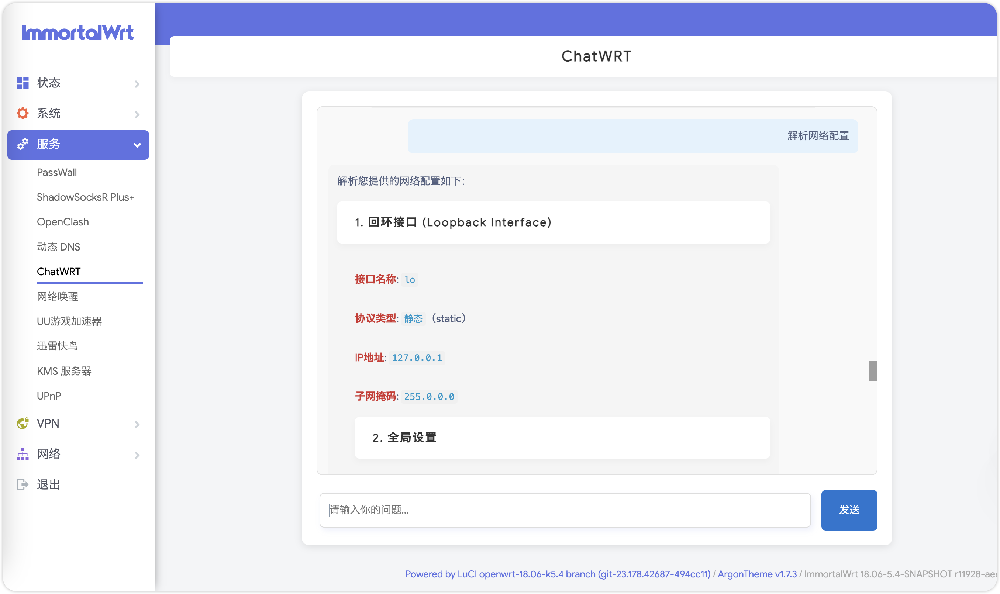

# ChatWRT

ChatWRT 是一个基于 OpenWrt 的智能路由器助手插件，它可以帮助用户通过自然语言对话的方式来查询和分析路由器的各项配置信息。

## 主要功能

- 📡 查询无线网络配置和状态
- 🌐 获取网络接口配置信息
- 🛡️ 查看防火墙规则
- 📊 获取系统状态信息
- 📝 查看系统日志
- 🔍 查看 DHCP 租约信息

## 安装说明

请将以下文件复制到相应的 OpenWrt 目录：

1. chatwrt.lua → /usr/lib/lua/luci/controller/chatwrt/chatwrt.lua
2. chat.htm → /usr/lib/lua/luci/view/chatwrt/chat.htm
3. 创建配置文件：/etc/config/chatwrt

配置文件内容示例：

config chatwrt 'config'
    option api_key 'your-api-key'
    option api_url 'https://api.openai.com/v1'

## 配置说明

1. api_key：您的 OpenAI API 密钥
2. api_url：API 服务器地址，可以使用官方接口或自定义代理

## 技术原理

ChatWRT 基于以下技术实现：

### Function Calling 机制
- 使用 OpenAI API 的 Function Calling 功能
- AI 模型根据用户问题智能调用相应的系统函数
- 支持多轮对话，确保信息的准确性和完整性

### 系统集成
- 通过 Lua 脚本与 OpenWrt 系统深度集成
- 使用 ubus 和系统命令获取实时数据
- 支持多种系统信息查询接口

## 安全性说明

1. 权限控制
   - 仅支持查询操作，不支持修改系统配置
   - 所有操作都在 LuCI 权限管理框架内执行
   - 需要管理员登录才能访问

2. API 安全
   - API 密钥存储在配置文件中，权限受限
   - 所有 API 请求使用 HTTPS 加密传输
   - 支持自定义 API 代理，避免直接暴露 API 密钥

3. 系统安全
   - 所有系统命令都经过预定义，避免注入风险
   - 操作日志完整记录，便于审计
   - 仅允许查询特定系统信息，不暴露敏感数据

## 使用方法

1. 安装完成后，在 OpenWrt 管理界面的"服务"菜单下可以找到 "ChatWRT" 选项
2. 点击进入后可以通过对话框与系统交互
3. 输入您的问题，比如：
   - "查看当前无线网络状态"
   - "显示所有网络接口配置"
   - "查看防火墙规则"

## 注意事项

- 请确保您的 OpenWrt 系统已安装 luci、curl 和 libubus-lua 包
- 首次使用需要配置正确的 API 密钥
- 所有的系统操作日志会记录在 /tmp/chatwrt.log 中

## 技术支持

如果遇到问题，可以：
1. 查看系统日志：cat /tmp/chatwrt.log
2. 检查配置文件权限
3. 确保网络可以正常访问 API 服务器